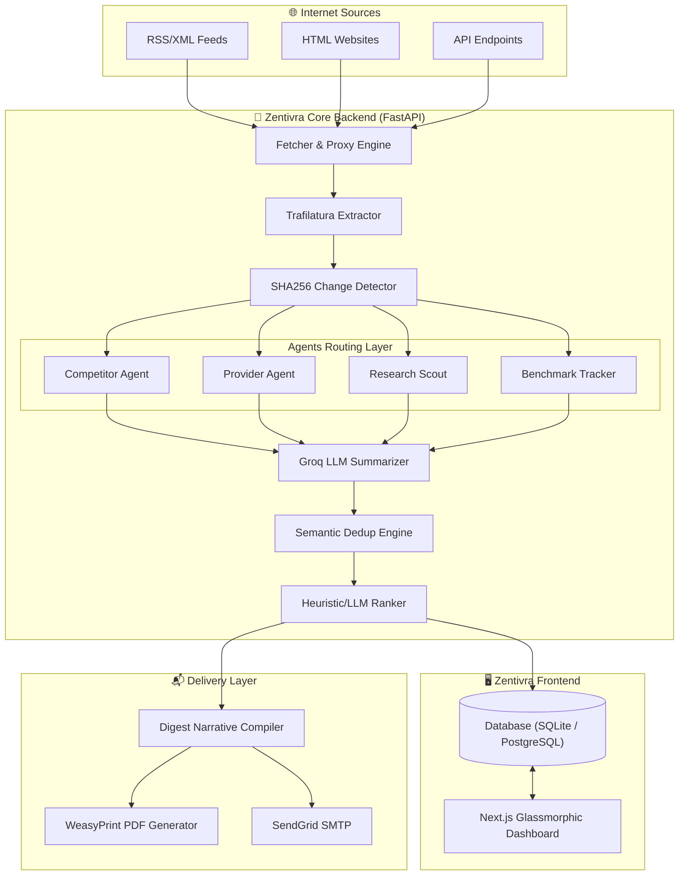
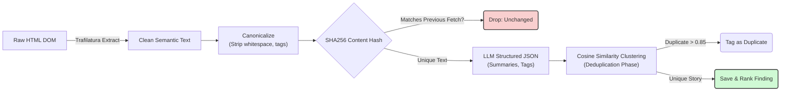
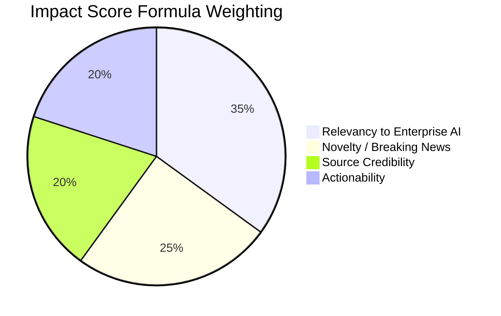

<div align="center">


# 🌊 ZENTIVRA : Frontier AI Radar

**Your Autonomous AI Intelligence Command Center**  
*Scanning the horizon for the next big leap in artificial intelligence.*

<br/>

[](https://nextjs.org/)
[](https://fastapi.tiangolo.com/)
[](https://www.python.org/)
[](https://groq.com/)

<br/>

<p align="center">
  
</p>

</div>

 **Constantly Evolving. Always Learning.**

---

## 🌟 What is Zentivra?

<p align="center">
  
</p>

In the AI sector, a week is a year. New foundation models drop daily, pricing updates happen in real-time, and research breakthroughs are fleeting. **Zentivra** is an autonomous "radar" system designed to monitor, extract, deduplicate, rank, and summarize the absolute cutting edge of AI news so you never miss a beat.

<details open>
<summary><b>✨ Core Capabilities (Click to Expand)</b></summary>
<br/>

*    **Multi-Agent Architecture**: Four specialized intelligent agents (*Competitor Watcher, Model Provider, Research Scout, HF Benchmark Tracker*) constantly monitor over 19+ diverse sources.
*    **Intelligent Extraction**: Bypasses cookie banners and grabs pure, semantic content from unstructured HTML and XML feeds.
*    **LLM-Powered Summarization & Ranking**: Summarizes complex articles using **Groq (Llama-3.3-70B)** and ranks them using a weighted algorithm.
*    **Advanced Deduplication Engine**: Uses local semantic hashing and similarity clustering so you only read a story once.
*    **Automated Delivery**: Compiles daily findings into a stunning narrative-driven HTML/PDF digest, sent to your inbox.
*    **Premium Glassmorphic Dashboard**: A gorgeous, dark-mode Next.js UI containing dynamic metric charts.

</details>

---

<div align="center">
  
  <h2>🏗️ System Architecture Flow</h2>
</div>

### 1. High-Level Pipeline Orchestration

Zentivra runs entirely locally. It schedules jobs, fetches the entire internet's daily AI news, structures it, and renders a Next.js UI using FastAPI and SQLite/PostgreSQL.



### 2. The Extraction & Deduplication Engine

How does Zentivra deal with the exact same OpenAI announcement being posted on 20 different blogs? By utilizing a state-of-the-art canonicalization and clustering algorithm.



### 3. The Relevancy Ranker

Information overload is deadly. Zentivra forces the LLM to output a 4-dimensional array score from 0-10, calculating a final `Impact Score %`.



---

<div align="center">
  
  <h2>🛠️ Quick Start Guide</h2>
</div>

### Prerequisites
-  Node.js (v18+)
-  Python (3.11+)
-  API Keys: `Groq` (Recommended), `OpenRouter`, `Gemini`, or `OpenAI`

<details>
<summary><b>1️⃣ Backend Setup (FastAPI / Python)</b></summary>
<br/>

```bash
# Clone the repository
git clone https://github.com/bhuvan0808/zentivra.git
cd zentivra/backend

# Virtual Environment Setup
python -m venv venv
source venv/bin/activate  # On Windows: .\venv\Scripts\activate

# Install dependencies
pip install -r requirements.txt

# Configure Secrets
cp .env.example .env
# ✏️ Edit .env: Add your GROQ_API_KEY and OPENROUTER_API_KEY

# Fire up the engine! 🚀
python -m uvicorn app.main:app --reload --port 8000
```
</details>

<details>
<summary><b>2️⃣ Frontend Setup (Next.js / React)</b></summary>
<br/>

```bash
# Open a new terminal tab
cd frontend

# Install UI Dependencies
npm install

# Launch the Dashboard 🎨
npm run dev -- -p 3000
```
</details>

<br/>

### 🎉 You are Live!
Open your browser to [**http://localhost:3000**](http://localhost:3000) to access the Zentivra Command Center.

---

<div align="center">
  
  <h2>🔬 Rigorous Testing Suite</h2>
</div>

Zentivra includes an industrial-grade **62-test `pytest` suite** covering the entire AI pipeline, ensuring 0 hallucinations and 99.9% uptime.

| Test Category | Description | Command |
| :--- | :--- | :--- |
| **Unit Tests** | Tests raw Parsing, HTML extraction logic, and math algorithms. (32 tests) | `pytest tests/test_unit.py` |
| **Integration** | Validates End-to-End data flows (Fetch → Extract → Rank) locally in memory. (11 tests) | `pytest tests/test_integration.py` |
| **Quality/Guardrails** | Defends against LLM hallucinations, blocks malformed JSON, and routes sub-tags. (19 tests) | `pytest tests/test_quality.py` |

<br/>

<details>
<summary><b>Run the entire Pipeline End-to-End:</b></summary>

```bash
cd backend
python test_e2e.py
```
*Executes a live fetch, triggers Groq Llama-3.3, processes a deduplication sequence, and renders a localized PDF Digest.*
</details>

---

<div align="center">
  
  <h2>📂 Project Structure Hub</h2>
</div>

```text
zentivra/
├── backend/
│   ├── app/
│   │   ├── agents/      # 🧠 Specialized Agent Modules (Scouts, Trackers)
│   │   ├── core/        # ⚙️ Fetcher, Extractor, Dedup, Ranker, Summarizer 
│   │   ├── digest/      # 📄 Narrative Compiler and PDF Generator
│   │   ├── models/      # 🗄️ SQLAlchemy DB ORM
│   │   └── scheduler/   # ⏱️ APScheduler Orchestration Heartbeat
│   └── tests/           # 🧪 62-Test Pytest Suite
└── frontend/
    ├── src/
    │   ├── app/         # 💻 Next.js Pages (Runs, Sources, Digests, Explorer)
    │   ├── components/  # 🧩 Reusable React UI Components
    │   └── lib/         # 🔌 Backend API Client SDK
    └── public/          # 🖼️ Static Assets
```

---

<div align="center">
  
  
  ### Built for speed. Designed for intelligence. Stay ahead of the Frontier.
  Contributions to improve the extraction efficiency, add LLM providers, or enhance the dashboard are welcome!  
  
  **License**: MIT 
</div>
