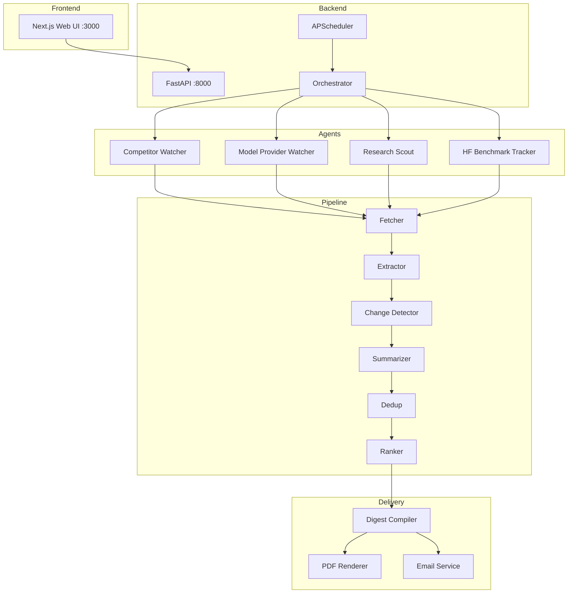

# Zentivra — Build Walkthrough

## All 6 Phases Complete (34/34 items)

### Architecture Overview



---

## Phase 6: Web UI Screenshots

### Sources Manager


### Findings Explorer


---

## E2E Test (Groq — Llama 3.3 70B)

| Step | Component | Result |
|---|---|---|
| Fetch | httpx → OpenAI blog | Content fetched |
| Extract | trafilatura | Text + title extracted |
| Change Detect | SHA256 | First fetch flagged |
| Summarize | Groq API | Structured JSON summary |
| Rank | Groq API | **Impact: 77.5%** |
| Dedup | Hash match | 1 duplicate removed |
| Compile | DigestCompiler | Sections + narratives |
| Output | PDFRenderer | [zentivra_digest_2026-03-05.html](file:///c:/Bhuvan/zentivra/backend/data/digests/zentivra_digest_2026-03-05.html) |

---

## Testing Suite

The project includes a comprehensive 62-test pytest suite covering the entire pipeline:

1. **Unit Tests (32 tests)**: Covers Extractor, ChangeDetector, DedupEngine, Ranker, PDFs, and Agent sub-type logic.
2. **Integration Tests (11 tests)**: End-to-end component chains (fetch → extract → detect → dedup → rank) and database model consistency.
3. **Quality Tests (19 tests)**: Validates LLM outputs (JSON parsing, malformed data, short content rejection), agent route inference, and settings edges.

All tests run locally with `pytest` without requiring live API keys.

---

## How to Run

```bash
# Backend (terminal 1)
cd backend
python -m uvicorn app.main:app --reload --port 8000

# Frontend (terminal 2)
cd frontend
npm run dev -- -p 3000
```

Open **http://localhost:3000** for the dashboard.
